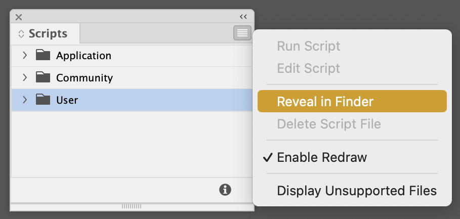
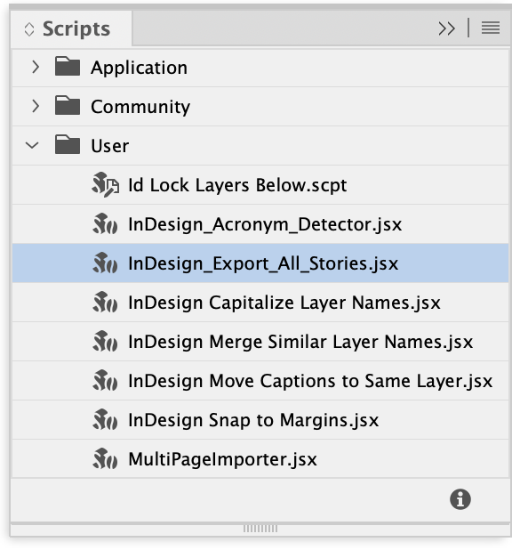
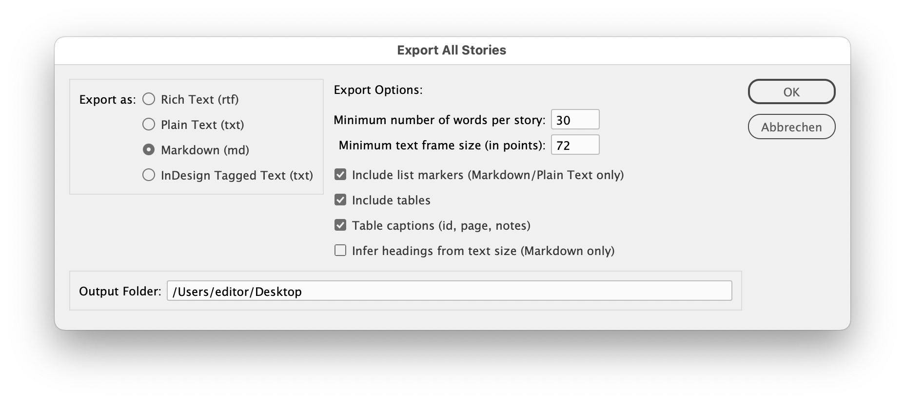
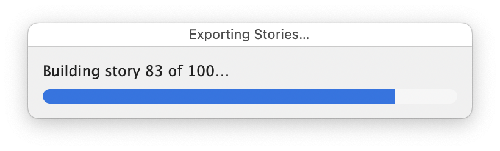
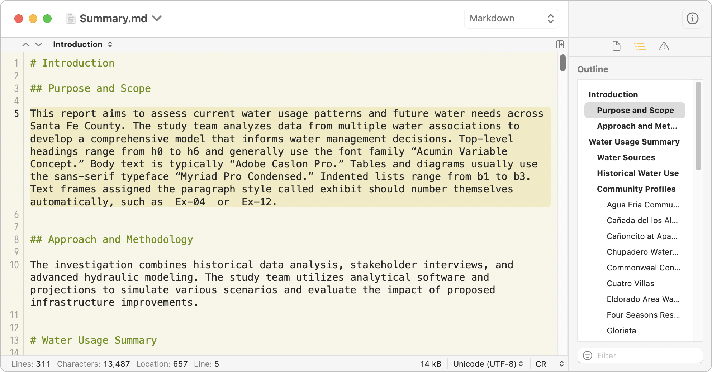

# InDesign Export All Stories

An [Adobe InDesign](https://www.adobe.com/products/indesign.html) JavaScript script that exports document content as plain text.

## Description

This script extracts text from an Adobe InDesign document and saves it as [plain text](https://amontalenti.com/2016/06/11/simple-and-universal-a-history-of-plain-text-and-why-it-matters), [Markdown](https://www.markdownguide.org/cheat-sheet/), Rich Text, or InDesign Tagged Text. Use it for data exchange, automated processing, backups, search indexing, or moving content into other tools. 

For Markdown and Plain Text, the script writes one file per document and orders stories by page, then top-to-bottom and left-to-right on each page. For RTF and Tagged Text, it writes one file per story, matching InDesign’s native exporter. 

## Features

- Processes the document in reading order, not in InDesign’s frame-creation order. 
- Supports four output formats: Plain Text (`.txt`), Markdown (`.md`), Rich Text (`.rtf`), and InDesign Tagged Text (`.txt`). 
- Detects headings from style names, the style chain, and paragraph text size. 
- Handles lists, including bullets, numbered lists, and structural lists inferred from hanging indents, with an option to preserve original numbering. 
- Extracts tables as TSV blocks or Markdown tables, and can add captions (id, page, notes); if a table does not anchor to any exported story, the script collects it in a “Standalone Tables” block at the end. 
- Resolves cross-references in body text. 
- Filters tiny text frames, pasteboard items, very short stories, and the Table-of-Contents story. 
- Sanitizes filenames for both Mac and Windows, removing illegal characters, control bytes, trailing dots/spaces, and reserved device names such as `CON`. 
- Leaves the open document unchanged and exports non-destructively. 

## Requirements

- Adobe InDesign (tested on recent versions; compatible with CS6+). 

## Installation

1. Download the script file: `InDesign_Export_All_Stories.jsx`. 
2. In Adobe InDesign, open the Scripts panel: **Window > Utilities > Scripts**. 
3. In the panel, expand the **User** folder, click the panel flyout menu (top-right), and choose **Reveal in Finder** (macOS) or **Reveal in Explorer** (Windows). 

4. Drag `InDesign_Export_All_Stories.jsx` into the revealed folder. 
5. Return to InDesign; the Scripts panel now lists the script under **User**. 

## Usage

1. Open the InDesign document. 
2. In the Scripts panel, double-click **InDesign_Export_All_Stories.jsx** under **User**.

3. Choose an output format and adjust options: 
   - **Rich Text (rtf)**: Preserves InDesign’s styling. One file per story. 
   - **Plain Text (txt)**: Stripped content, list markers optional. Single consolidated file. 
   - **Markdown (md)**: Writes headings, lists, and tables as Markdown. Single consolidated file. 
   - **InDesign Tagged Text (txt)**: Lossless round-trippable text format. One file per story. 

   Options: 
   - **Minimum words per story** and **minimum text frame size** let you filter captions, page numbers, and stray fragments. 
   - **Include list markers** preserves numbering and bullet glyphs (Markdown and Plain Text only). 
   - **Include tables** and **Table captions** export tables as TSV or Markdown and can add id/page metadata. 
   - **Infer headings from text size** helps with documents that lack consistent paragraph styles and ranks distinct point sizes into H1–H6 (Markdown only). 

4. Click **OK** to export. After the export, the script reveals the result in the Finder (macOS) or opens the output folder in Explorer (Windows). It shows a dialog only if some stories fail or nothing qualifies for export. The script never overwrites existing files; it appends a numeric suffix instead. 

5. Review the output file for accuracy; structure detection works on a best-effort basis. 

The script keeps the original InDesign document unchanged and generates a minimal text version for external use. 

## Notes

- Enhanced adaptation of Adobe’s original `ExportAllStories.jsx` (last updated December 2009), with additional formats and Markdown support. 

### Known limitations

- The script rewrites auto page-number placeholders to `[#]` only when the English word “Page” precedes them; in other languages it removes the placeholder character. 
- The script does not export nested tables (tables inside other table cells); it only collects top-level tables in each story. 
- The minimum frame-size filter requires both dimensions to meet the threshold. With the default 72 pt, the script skips a full-width but short standalone frame (for example, a one-line headline in its own unthreaded frame). Lower the value if you want to include such frames. 
- For scripting details, see the [InDesign Scripting SDK](https://www.adobe.com/devnet/indesign/sdk.html) or the [InDesign Scripting Forum](https://community.adobe.com/t5/indesign-discussions/ct-p/ct-indesign?page=1&sort=latest_replies&lang=all&tabid=all). 

## License

MIT License. See `license.md` for details. The script derives from Adobe's original `ExportAllStories.jsx`, distributed under the [Adobe SDK license](https://developer.adobe.com/indesign/).